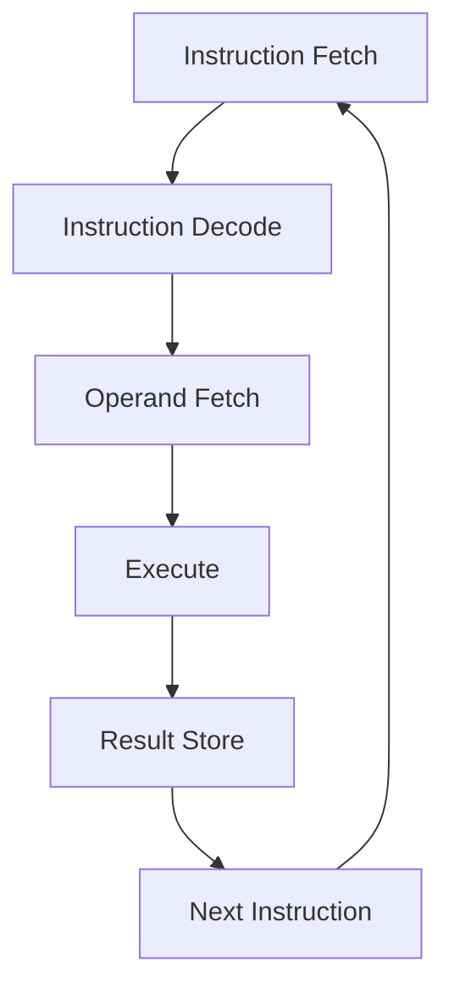

## Basic Infomation
名称
- 数字逻辑和计算机组成
- 考核
	- 课后作业、问答：15%
		- [click me check the 3 chapter assignment|600](https://kold.oss-cn-shanghai.aliyuncs.com/d18405c59099b86d65d4996969d22007.png)
		- [[DL-CO-1]]
		- [[DL-CO-3|Chapter3 组合逻辑相关]]
		- [[DL-CO-4|Chapter 4 时序逻辑相关]] 
		- [[DLCO-6| Chapter 6 机器数表示]]
		- [[DLCO-7 | Chapter 7 ISA related]]
		- [[DLCO-8 | Chapter 8CPU]]
	
	

	- 六次实验成绩: 35% （实验验收、报告）
		- [[ DLCO-labs-note| About labs]] 
		- [[DLCO-lab1-report]]
		- [[DLCO-lab2-report]]
		- [[DLCO-lab3-report]]
		- [[DLCO-lab4-report]]
		- [[DLCO-lab5-report]] 
		- [[DLCO-lab6-report]]
- 


- 世界上第一台电子计算机 ABC（非通用）
	- 不可编程
- 通用电子计算机 ENIAC
	- 能变成
	- 二进制
	- 非存储程序
	- 非冯诺伊曼结构
## [[DLCO - Data in Computer]]
## [[Logic Gate and CMOS]]
## [[DLCO-BooleanAlgebra]]
##  [[组合逻辑电路]]


## [[时序逻辑电路]]

##  [[DLCO - FPGA 设计和硬件描述语言]]


##  [[DLCO - Compute Algorithm and Compute Part]]


## Floating-point number
**不考**

 **浮点数运算结果**
$A=M_{a}\cdot_{2}^{E_{a}}$
$B=M_{b}\cdot 2^{E_{b}}$

则
$$
A\pm B=(M_{a}\pm M_{b}\cdot2^{-(E_{a}-E_{b})})\cdot{2}^{E_{a}}
$$

### 加减法

四个步骤：
- **对阶**
- **尾数加减**
- **尾数规格化**
- **尾数舍入**

## ISA
**从指令执行周期看指令设计涉及的问题**



参考 PA
[[ICS-PA2 note#更新 PC|如何更新PC]]

- IBM370
**思考**：我们用 16 个通用寄存器来做，**编号需要几位**？
- `4` bit


- **不同指令设计风格**
- CISC
	- Complex Instruction Set Computing
	- 通用寄存器型
- RISC
	- Reduced Instruction Set Computing
	- load/store 型
	- 也用内存，但是必须有专门的访问内存的指令
中断：
- **内部中断**
- **外部中断**
	- **打印机缺纸**


### RISCV 寄存器约定
可以阅读 [[ICS-PA2 note#`riscv` 如何判别 `call` 和 `ret`？|riscv判别`call`和`ret`的办法]]

### 具体指令

你参加的 PA 是 `riscv32` 的，这对你再熟悉不过 [[ICS-PA2 note]] 

**这门课需要你更注意一些基于这些最基本指令的高级语言层面操作**。

> [!Note] `long long` 64bit 数相加的机器级表示
> x 的高、低 32 位分别存放 `x13`, `x12`
> y 的高、低 32 位分别存放 `x15`, `x14`
> z 的高、低 32 位分别存放 `x11`, `x10`

 在以上假设下，我们可以用 `sltu` 将低 32 位的进位加入到高 `32` 位中
- **为什么**？如果 `sum < 两个加数`，一定产生了进位。
```asm
add 	x10,	x12,	x14
sltu	x11,	x10,	x12		// if x11(low_x+low_y) < x12, then R[x11]<-1
add		x16,	x13,	x15		// R[x16]<-R[x13]+R[x15] (high_x+high_y)
add		x11,	x11,	x16		// R[x11]<-R[x11]+R[x16]	(compute carry bit)
```


## [[CPU Related]]


## test
- 都是简答题
- 电路和 CPU
- **时序电路设计**
	- 状态设计
	- 卡诺图化简
- **CPU**
	- 不能单靠 CPU，相关联的几个题
	- 后面这部分没有画图了
	- 分析计算。


- **题型**

- CPU
	- 多周期、流水线两个题
- 大概一共那么多章内容。
- **不考除法**！
- **浮点数不考**！
**异常中断**不考


### Review
- 不同层次语言之间的等价转换
- You must be clear with how the high-level source code finally become machine level code, and to do at hardware by the ISA.

- ISA:
	- Instruction Set Architecture
	- format, operation type, addressing model
- **编码**


- 不需要掌握 PMOS NMOS 们
- 了解缓冲-三态门原理即可
- **但是可能有**连线。
- 不会考基于布尔代数的背诵。
- **参考作业题**（卡诺图！）

- **组合逻辑电路**：
	- 输出值仅仅依赖于输入值
	- **电路设计**：*参考作业题*

- 会计算组合逻辑电路的
	- **传输延迟**
	- **最小延迟**
	- 时序逻辑电路分析的基础。


- **时序逻辑基本元件**
	- D **触发器**的大概的原理，
		- 什么是 Clk-Q time
		- 什么是 Setup 时间
		- 什么是 Hold 时间
	- 不仅依赖当前输入，**还要依赖电路现在的状态**
	- *状态图* 或者状态表
	- *时序电路设计*
		- 功能分析-状态图-状态化简和编码-逻辑表达式-画图-评价（***参考作业题***）
	- *未用状态分析*（挂起/无法自启动）
	- 基本的元件


- 存储器的结构和基本概念。
- **只需要掌握**存储器和寄存器大概的样子即可
	- 存储器阵列中每位数据对一个记忆单元 (cell)，称为存储元


- **CPU**
	- CPU 执行时间 = 指令条数 x CPI x 时钟周期
	- CPU
		- 数据通路：实现 ISA 中所有指令的操作功能 
		- **控制器**：控制数据通路中各部件进行正确操作
- **多周期处理器的设计**
	- 每条指令分成多个阶段。
	- 每一条指令包含的时钟个数不同
	- **不会从头设计**
	- 可用 PLA 和 micro program 来处理


- 流水线 **CPU**
	- 和多周期类似：和指令规范位若干个同样的流水线阶段
	- 为了避免结构冒险。规约成同样数量的解读哪
	- 每个流水阶段一个 clk
- 单周期多周期流水线性能对比（对比 RISC-V）
