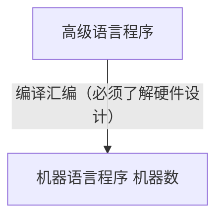

## Section 2 ：数据的机器级表示与处理
——数值数据的表示
关于高级语言->机器语言
- 表示
- 链接
- 执行

本章主要学习数据的机器级表示

### Intro. Kahan 累加算法
- **浮点数存在误差**
	- `4000000` 个 `0.1(float)` 相加（C 语言）结果可能不是 `400,000`
	- 为了解决累加误差，有经典的 Kahan 累加算法
```c
function KahanSum(input)
    var sum = 0.0
    var c = 0.0          //A running compensation for lost low-order bits.
    for i = 1 to input.length do
        y = input[i] - c    //So far, so good: c is zero.
        t = sum + y         //Alas, sum is big, y small, so low-order digits of y are lost.
        c = (t - sum) - y   //(t - sum) recovers the high-order part of y; subtracting y recovers -(low part of y)
        sum = t             //Algebraically, c should always be zero. Beware eagerly optimising compilers!
        //Next time around, the lost low part will be added to y in a fresh attempt.
    return sum

```

- 我们用一个独立的变量 `c`，记录被截断的低位。
- `30000+3.14159=30003.1`
- 但是 `30003.1-30000=3.1`，可以与 `sum` 作差得到偏差。


### 数值数据的表示

- **数值数据表示的三要素**
	- 进位计数制
		- 十进制、二进制、十六进制、八进制？
	- 定/浮点表示（解决小数点问题）
		- **定点整数、定点小数**
			- 定点整数默认小数点最右，定点小数默认小数点最左，都无需表示。
		- 浮点数
	- **编码**
		- 原码 (Signed magnitude)
			- **缺点**：0 的表示方法不唯一
				- 用首位表达**正和负**
				- 加减方法不唯一
				- 额外对符号化处理
		- 反码 (One' s complement)
		- **补码 (Two' s complement)**
			- 使用模运算 (modular)
				- 时钟是一个模 12 系统，倒拨 `4` 和顺拨 `8` 是等价的
			- **结论 1**
				- 一个负数的补码等于**模减该负数的绝对值**
				- **二进制系统推广**
					- 一个负数的补码等于对应正数的“**各位取反，末位+1**”
					- 这实际是因为 k 位运算系统的模 `2^k` 可以表示为 `2^k-1+1`，而 `2^(k-1)-x` 等价于 `x` 的各位取反，最后再加上 1 即可
			- **结论 2**
				- 对于某一确定的模，某数减去小于模的另一数，总可以用该数加上另一数负数的补码来代替。
			- **负数去哪里了？**
				- 对于 `short int` 类型实现来思考，我们仍然可以用补码的思想，且保证首位是符号位
		- 移码 (Biased notation) 
			- （浮点数的阶码）
			- 移码（**biased exponent**）是一种用来表示有符号整数的编码方式，主要用于浮点数表示中。它的核心思想是，**在真值的基础上加上一个固定的偏移量（bias）**，从而将所有可能的负数和正数都映射成非负整数。
			- **移码**没有符号位
```c
#include<limits.h>
#include <stdio.h>
#include <stdint.h>
int main(){
	short a = INT8_MAX;
	short b = INT8_MIN;
	printf("%d,%d",a,b);
	return 0;
}
// out: 127, -128
```


- **无符号数**
	- `unsigned int`
- 有符号数
	- `int`
- 
- 这样一个程序在 C90 运行结果如何？
	- note: `32bit` system  
- 
- `2147483648` 实际上表示为二进制是 1 后面跟着 31 个 0


### IEEE754 表示法
IEEE 754 标准是目前最广泛使用的**浮点数**（Floating-Point Number）表示标准，被绝大多数现代处理器所采用。它定义了一种统一的方式来存储和处理非整数，极大地保证了不同计算机系统间浮点计算的**一致性**。

这个标准的核心思想是将一个浮点数拆分成三个部分：**符号位**、**指数**和**尾数**（或称**有效数字**）。

一个浮点数的最终值可以表示为：

$$
V=(-1)^{S}\times M\times 2^{E}
$$
其中：

- **S** 是**符号位**（Sign）：占1个比特位，决定了数的正负。`0` 表示正数，`1` 表示负数。
    
- **M** 是**尾数**（Mantissa/Significand）：表示数值的有效数字部分，通常用**归一化**形式表示，即小数点前有一个隐藏的 `1`。
	- 即除了二进制串的字符从 `2^-1` 开始算之外，你还需要一个隐藏的 `1` 加在尾数之前组成一个 `1.xxx` 的数
	    
- **E** 是**指数**（Exponent）：表示数值的量级大小，用**偏移量**（Bias）表示，以处理负指数。
    

---

### 单精度（Single-Precision，32位）

- **总共32位**
- **符号位**：1位 (第31位)
- **指数**：8位 (第23-30位)
    
- **尾数**：23位 (第0-22位)
    

指数的偏移量为127。计算实际指数 $E_{real} = E_{stored} - 127$。

尾数采用归一化表示，默认隐藏了小数点前的 1。所以实际尾数 M_real = 1.M_stored。

---

### 双精度（Double-Precision，64位）

- **总共64位**
- **符号位**：1位 (第63位)
- **指数**：11位 (第52-62位)
- **尾数**：52位 (第0-51位)
指数的偏移量为1023。计算实际指数 E_real = E_stored - 1023。
尾数同样采用归一化表示，默认隐藏了小数点前的 1。
除了常规数值，IEEE 754 标准还定义了几个特殊值：
- **正/负无穷大** (±∞)：指数部分全为1，尾数部分全为0。
- **非数字**（NaN，Not a Number）：指数部分全为1，尾数部分非0，表示无效或无法定义的计算结果（如 `0/0`）。
- **非归一化数**（Denormalized Number）：指数部分全为0，尾数部分不为0，用于表示非常接近于0的数。
#### have a try
`-12.75`
- first, for `-12.75` is a negative number, so sign bit is `1`
- second, for integer part, the binary representation of `12` is `1100`
- thirdly, consider `0.75`, which is `0.5+0.25` = `2^(-1)+2^(-2)`,  can be represented as `0.11_binary`
- **Normalization**
	- Use 科学计数法
	- `1100.11` = `1.10011 \times 2^3`
	- now we have a pattern similar to standard form
	- `M=10011`
	- `E=3`, but IEEE have a **offset** of `127`,
		- `3+127=130`
		- convert `130` to an 8-bit binary number `10000010`
- Calculate Mantissa (尾数)
	- The normalized mantissa is `1.10011`, The standard hides the leading `1`, we only store the fractional part:
		- `10011`
- Combine the **result**
	Finally, we assemble the three parts in order: **Sign bit** | **Exponent** | **Mantissa**.
	- **Sign**: `1`
	- **Exponent**: `10000010`
	- **Mantissa**: 
		- `10011000000000000000000` 


### 浮点数的非规格化表示 (Denormalized Representation)

在 IEEE 754 浮点数标准中，**非规格化数**（Denormalized Numbers 或 Subnormal Numbers）是一种特殊的表示形式，旨在填补**最小正规格化数**和**零**之间的“间隙”。

对于**规格化数**，我们知道其指数位不全为0，并且尾数部分有一个**隐藏的1**。这使得最小可表示数有一个较大的跳跃，直接从这个数跳到0。为了解决这个问题，IEEE 754 标准引入了非规格化表示。

---

#### 非规格化数的特点

- **指数域全为0**：这是识别非规格化数最关键的特征。当指数部分的所有位都是0时，该浮点数被认为是**非规格化**的。
    
- **尾数域不为0**：如果尾数域也为0，则该数被定义为**零**。
    
- **没有隐藏的1**：与规格化数不同，非规格化数的尾数部分**没有隐藏的1**。其尾数的实际值就是其存储的值，即 0.M。
    

---

#### 最小的非零正浮点数
非规格化数允许我们以更小的步长逐渐接近0，从而提供更高的精度来表示非常小的数。

我们来计算一下**单精度（32位）**浮点数中最小的非零正数。
根据非规格化数的定义：
- **符号位**：`0`（正数）
- **指数域**：`00000000`（全为0）
- **尾数域**：**最小非零值**，即 `00000000000000000000001`（最后一位为1，其余为0）
根据公式
$$
V=(-1)^{S}\times M\times 2^{E}
$$
- **S** = 0
- **指数 E**：在非规格化数中，实际指数值被定义为 `1 - 偏移量`，单精度的偏移量为**127**，所以 Ereal​=1−127=−126。
- **尾数 M**：由于没有隐藏的1，其值为 0.00...012​ （共23位），即 2−23。
代入公式：

所以，**单精度浮点数能表示的最小非零正数是 `2^(-149)`**。

### 逻辑数据的编码表示

- **表示**
	- 用 1 bit 表示
	- True: `1`
	- False: `0`
- 运算
	- 按位进行
- **识别**
	- **和数值数据形式上没有区别**
	- When we use it, we use 指令 to indentify
- 位串
	- 用来表示 若干个状态位或控制位


### 西文字符的编码显示
- **特点**
	- 拼音文字，字符优先
	- 只对有限个字母、数学符号、标点符号等辅助字符编码
- **表示**
	- **常用**：7bit ASCII 码
	- 十进制数字 `0-9`
	- 英文字母:  `A-Z`
	- 控制字符
- 扩充 ASCII **字符集**
	- ISO8899
	- 这次是完整的 8bit 空间了


### 汉字、国际字符的编码表示

- 特点
	- 汉字是表意文字，一个字就是一个方块图形
	- 汉字数量巨大
		- **需要很大的**码位

- GB2312
	- 2bytes 表示一个汉字 `16bit,65536`
	- 一共收录 60000 多个简体字
- CJK
	- 中日韩统一计划
- GBK
	- 汉字内码拓展规范
	- 用首字节的 1 和 0 标记按双字节还是单字节解释，保证兼容性
		- 兼容 GB2312
- UCS
- UTF-8 (UCS Transformation Form - 8)
	- 可变长形式
	- 可表示单字节-4 字节内容

- UTF-16
	- 最常用。（固定用双字节表示字符）
	- **永远两个字节**
	- 65536


#### 汉字的字模点阵码和轮廓描述
汉字要表示，需要预先存储字体来渲染出来。

- **点阵字体**
	- 类似于一张图片，像素点画出汉字，形成点阵，存储点阵的位置。
	- **优点**：可直接用输出设备如光栅显示，实现简单
	- **缺点**：
		- 不方便加粗、斜体等格式修改，或者放大缩小会有失真。
	- 
-  **矢量字体**
	- Postscript
	- TrueType Font
	- 更好的对字进行变化。


###  数据的基本宽度

- bit 最小单位
- 字节 (Byte)
	- 二进制信息的计量单位
	- 1 个字节=8bit
	- 现代存储器通常按字节编地址
	- 此时，字节是最小可寻址单位
		- (addressable unit)
- 字 word 也经常用来作为数据的长度单位
	- 1 个字一般是 16bit

- **字**和 **字长**的概念不同
	- 字长：定点运算数据通路的宽度
		- CPU 内部的运算、存储、传送部件，宽度基本上一致才可以匹配。“字长”是内部的组织。



### 机器数（数据）的存储和排列顺序

- 大端序
- 小端序

如果以一个字节为排列单位，则
- **LSB**(Least Significant Byte) 表示最低有效字节
- **MSB**表示最高有效字节

- ISA 设计的两个问题
	- 如何根据一个地址取到一个 32 位的字？
	- 一个字能否存放在任何地址边界？


#### 大端方式和小端方式

Big Endian
Little Endian
**大端（Big-Endian）** 和 **小端（Little-Endian）** 是计算机存储数据时的两种不同字节顺序。它们主要影响多字节数据类型，比如整型（`int`）或浮点型（`float`）在内存中的存储方式。

可以把它们想象成书写多位数字（比如 1234）的两种不同方式：

- **大端（Big-Endian）**: 就像我们平时写数字一样，**最高有效字节**（MSB，Most Significant Byte）放在内存地址的**最低位**（最前面）。
    
    - 例如，数字 `0x12345678` 存储在内存中会是：`12 34 56 78`。
        
    - “大头在前”，这种方式更符合我们的阅读习惯。很多网络协议都采用大端序，所以它也被称为**网络字节序**。
        
- **小端（Little-Endian）**: 就像从右往左写数字一样，**最低有效字节**（LSB，Least Significant Byte）放在内存地址的**最低位**。
    
    - 例如，数字 `0x12345678` 存储在内存中会是：`78 56 34 12`。
        
    - “小头在前”，这种方式在大部分个人电脑（如基于 x86 架构的处理器）和 ARM 处理器上比较常见。
        

---

##### 简单对比

|特性|大端（Big-Endian）|小端（Little-Endian）|
|---|---|---|
|**存储顺序**|高位字节存放在低位地址|低位字节存放在低位地址|
|**形象比喻**|正常阅读顺序，“大头在前”|反向阅读顺序，“小头在前”|
|**常见场景**|网络传输（网络字节序）、Java虚拟机、PowerPC|个人电脑（Intel/AMD x86架构）、ARM处理器|

##### 为什么需要了解它们？

在大多数情况下，作为开发者，你不需要关心字节序，因为编译器和操作系统已经处理好了。但是，当你进行**跨平台通信**或处理**二进制文件**时，字节序就变得至关重要。

例如，当一台大端机器向一台小端机器发送数据时，如果直接传输，接收方会因为字节顺序颠倒而错误地解析数据。这时就需要进行**字节序转换**，确保数据在不同系统间能正确地被理解。

在计网试验中你应该足够了解 [[Lessons/计算机网络/exps/exp3/README|README]]


### 浮点数的加减运算
- **对阶**
	- **小阶往大阶对**
	- 在进行加法之前，两个浮点数的**阶码**必须保持一致。因为浮点数是科学计数法的一种形式，比如 1.23×105 和 4.56×103，你不能直接把它们的有效数字（1.23 和 4.56）加起来。
	- 对阶的步骤是：
	- **比较**两个浮点数的阶码，找出较大的那个。
	- 将阶码较小的那个数的**小数部分**向右移动，同时增加其阶码，直到两个数的阶码相等。
- 对 IEEE754 SP 格式来说，$\Delta E$ 大于多少时候，结果就等于阶大的那个数？（大数被小数吃掉）
	- `25`
		-  **符号位（Sign）**：1位
		- **阶码（Exponent）**：8位，采用移码表示
		- **小数部分/尾数（Fraction/Mantissa）**：23位
		- 由于有一个隐含头位 `1`，实际有效尾数为 `24`
- Extra Bits （附加位）
	- IEEE 754 规定，后面跟着 2bit 的 Extra Bits
	- `guard digit`, `rounding digit`
	- `round digit`: （就近舍入到偶数）
		- `<1/2`: then truncate （截去）
		- `>1/2`: then round up (add `1` to ULP)
		- `=1/2`: round up to **nearest** even bit
- `float` 能精确刻画的十进制数位
	- 
	- `2^23=8388608`, `7 bit`
	- 表示范围不会溢出，**但是精度会损耗**
- `float` 转化为 `int` 会精度损失，但是 `double` 就不会了.


### Kahan sum 再看 [[#Intro. Kahan 累加算法]]

我们写一个 C 程序来看：
```cpp
#include <stdio.h>

// Kahan 累加算法
float kahanSum(const float arr[], int n) {
    float sum = 0.0;
    float c = 0.0; // 补偿值
    
    for (int i = 0; i < n; i++) {
        float y = arr[i] - c; // 减去补偿值，得到需要累加的有效值
        float t = sum + y;    // 临时累加
        c = (t - sum) - y;     // 重新计算补偿值，捕获被舍弃的低位
        sum = t;               // 更新总和
    }
    
    return sum;
}

// 简单直接累加
float simpleSum(const float arr[], int n) {
    float sum = 0.0;
    for (int i = 0; i < n; i++) {
        sum += arr[i];
    }
    return sum;
}

int main() {
    // 构造一个数组，其中包含一个大数和一系列小数
    // 每次累加一个非常小的数
    const int N = 1000000;
    float arr[N];
    float small_number = 1.0e-8;
    
    for (int i = 0; i < N; i++) {
        arr[i] = small_number;
    }
    
    printf("数组中包含 %d 个 %.10f\n", n, small_number);
    printf("理论上的精确值是：%.10f\n", n * small_number);
    printf("-----------------------------------\n");

    // 直接累加
    float result_simple = simplesum(arr, n);
    printf("简单累加的结果: %.10f\n", result_simple);

    // kahan 累加
    float result_kahan = kahansum(arr, n);
    printf("kahan累加的结果: %.10f\n", result_kahan);

    // 比较结果
    printf("-----------------------------------\n");
    printf("结果差异（简单累加 - kahan累加）: %.10f\n", result_simple - result_kahan);
    
    return 0;
}
```

- output
- 

